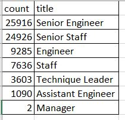

# Module 6 Challenge – Pewlett-Hackard Analysis
## Overview of Pewlett-Hackard Analysis
**#Purpose**

   The purpose of this analysis is to determine the number of retiring employees per title and identify 
   
   employees who are eligible to participate in a mentorship program. 
    
# Results

**There is a bulleted list with four major points from the two analysis deliverables.**

* A total of 1,5498 employees are eligible to participate in the mentorship program.

* According to our analysis 72,458 positions will need to be filled as a result of the “silver tsunami”.

* A large percentage of the retirees are Senior Engineers and Senior Staff.

### Eligible Retirees are as follows:

* 25,916 Senior Engineers
    
* 24,926 Senior Staff
    
* 9,285 Engineers
    
* 7,636 Staff
    
* 3,603 Technique Leader 
    
* 1,090 Assistant Engineer
    
* 2 Managers

**1. How many roles will need to be filled as the "silver tsunami" begins to make an impact?**

        According to our analysis a total of 72,458 positions will need to be filled before the “silver tsunami" 
        
        begins to make an impact. 

**2. Are there enough qualified, retirement-ready employees in the departments to mentor the next generation of Pewlett Hackard employees?**

        Unfortunately, no. There are only 1,5498 employees who are eligible to participate in the
        
        mentorship program. 

